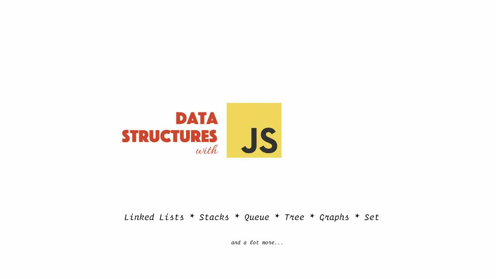

## How to get output?

- First, `npm install`
- Then, just type 

    `npm run linkedList`
    
    `npm run doubleLinkedList`
    
    `npm run stackAndQueue`

#### ⚠️ This repository is currently in active development. Changes to this repo will be frequent.
